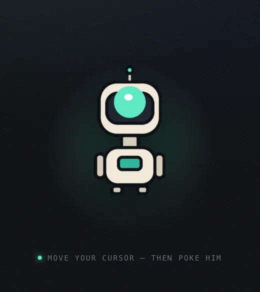

# mascotify


Turn one character image into production-ready mascot assets — sprite sheets,
animated WebP, Lottie, and bundles for iOS, Android, web, Unity and Godot. Or
into a character that watches the cursor and blinks when you poke it.

**No API key on the CLI path.** Your coding agent is the image provider:
mascotify compiles the prompt, the agent's own image tool draws it, mascotify
measures the result and exports it. Codex's built-in `image_gen`, or any agent
that can generate an image, is enough.

A browser has no agent of its own, so the web app shells out to the one you are
already signed in to. Still no key — just slower, because a turn through an
agent takes a minute where an API call takes seconds.

```bash
uv tool install git+https://github.com/dige04/mascotify.git
mascotify install-skill          # teach your agent to drive it
```

Then, in your agent: *"make me a waving robot mascot for this app."*

## The web app

```bash
uv tool install 'mascotify[web] @ git+https://github.com/dige04/mascotify.git'
mascotify serve            # http://127.0.0.1:8765
```


It follows your system theme, and the control in the top right overrides it.
The two are not the same palette inverted: on paper the depth comes from
shadow and rule weight, so the glow the dark theme lights everything with goes
out entirely and the accent darkens far enough to be read as text.

Describe a mascot, pick a motion, get an animated preview and every platform
bundle as one download.

Those six are not a mockup, and not a still either — see them moving
[below](#a-mascot-that-follows-the-cursor). Each was drawn by a coding agent
from `anchor_prompt`, turned into two 3x3 grids from that anchor, then keyed,
normalised and exported by `pose-ingest`. The app reads them from your own
`.mascotify/poses/`, so the masthead fills up with the characters *you* made; a
fresh project falls back to the one that ships.

Five of the six needed `--force`: the generator drifted the body 13% to 52%
sideways across the cells, past the 6% budget. That is the gate working as
designed rather than a defect — the anchor pass corrects it, and the budget
exists to say it had to. After correction all six sit within 0.2%.

**It needs no key either.** The default provider is `agent`: mascotify shells
out to the coding agent you already have signed in — Codex, or Gemini CLI — and
uses its image tool. Nothing is charged and nothing is configured. If `codex` is
on your PATH, the web app works on first run.

The trade is latency: a turn through an agent takes a minute or two where an API
call takes seconds. Paste an OpenAI, Gemini, fal or Replicate key into settings
if you would rather pay to skip the wait; a key stays in that process's memory,
never written to disk and never returned to the browser.

A third route skips generation entirely — draw a sheet with your agent in a
chat, then drop the file into step 2. Validation, preview and export are the
same code either way; the browser only ever replaces the drawing step.

It binds to loopback and refuses any request whose `Host` or `Origin` is not
this machine. There is no authentication here, `multipart/form-data` is
CORS-safelisted so a cross-origin upload needs no preflight, and DNS rebinding
defeats CORS outright — without that check a page you happen to have open could
spend your key. Do not expose it to a LAN or the internet.

**Status of the provider adapters:** each one is tested against a stub serving
its documented response shape, which proves mascotify builds the request and
finds the image correctly. The shapes themselves have **not** been checked
against live accounts, and model catalogues move — if a call fails, the error
names the cause and settings takes a current model id.

## What the CLI path gives you that a hosted product cannot

**It writes into your repo.** From the CLI, exports are not a zip in your Downloads folder.
`ingest` drops an Xcode `.imageset` with a SwiftUI view, a `res/drawable` WebP
with the Kotlin to play it, a CSS `steps()` sheet, a Godot `SpriteFrames`
resource — each with the snippet that actually runs it.

**Your agent does the QA.** Every generation is measured: frame count, canvas
clipping, character scale drift, loop seam. Failures come back as a repair
prompt, not an error. And because the caller is a multimodal agent, it can also
*look* at the sheet and catch the things geometry cannot — a broken hand, a
wave that reads as a salute — then reroll. A hosted product charges you for
that pass.

The web app runs the same validator and shows the same numbers, but the reroll
is yours to press.

## How it works

```
mascotify anchor "a friendly rounded robot, big visor eye, teal and cream"
   → prompt for one canonical still. Your agent generates it → ref.png

mascotify plan --ref ref.png --action wave
   → prompt for a 12-frame grid, 4 columns x 3 rows. Your agent draws it → sheet.png

mascotify ingest .mascotify/wave/sheet.png
   → keys out the backdrop, finds the frames, normalises, packs, exports
```

The anchor exists because sheets drift from their reference but frames within
one sheet do not. Approve one still, then reuse it for every animation and the
mascot stays itself across screens.

```bash
mascotify motions                          # wave idle bounce nod blink point typing think ...
mascotify doctor sheet.png                 # measure without exporting, JSON out
mascotify compare --ref ref.png --against sheet.png   # size-matched identity strip
mascotify plan --rows 4 --cols 6 --fps 24  # 24 frames, still no key needed
mascotify poses                            # the pose vocabulary, for the cursor-tracker
```

## A mascot that follows the cursor

Not every mascot animates. If what you want is a character that watches the
pointer and reacts to a click, that is not a loop — it is two 3x3 grids of
poses, nine head directions and nine expressions, with nothing playing.


Which together do this — the six from the screenshot above, answering a cursor
walked in a circle around them, then one of them poked:



```bash
mascotify pose-plan --ref ref.png --job fox     # prompts for both grids
mascotify pose-ingest --job fox \
  --directions .mascotify/poses/fox/directions.png \
  --reactions  .mascotify/poses/fox/reactions.png
```

The export is two lossless `.webp` sheets and the JSX, for
[page-mascot](https://github.com/nilbuild/page-mascot) — an npm component that
does the rendering. Lossless because the component samples cells with
`background-position`, and a lossy edge shows up at runtime as a sliver of the
neighbouring pose down the side of the mascot.

Both sheets are ingested in one call and normalised as eighteen frames on one
canvas. Separately they would land on two canvases and two baselines, and the
character would jump every time you poked it.

The measurement that matters here is different from the animation path's. A
turned head widens the character's bounding box, so centring each cell on its
own box slides the body *away* from the side the head turned towards — a mascot
that leans away from the cursor following it. So placement is measured from the
feet up, against the cell the character was drawn in, before anything is
normalised: that tells a head that turns apart from a body that walks around,
which a bounding box cannot. It is also the only way to catch the two sheets
seating the body in different places, which is invisible until the first click.

One thing it cannot check is cell order. Nine plausible head turns in the wrong
cells measure perfectly and track the cursor backwards, so `pose-plan` tells the
agent to look at the sheet and confirm — the same division of labour as the rest
of the tool.

## Does the agent loop actually work?

Yes, and it is tested rather than asserted. Given an empty web project and one
sentence — *"Make me an animated waving robot mascot for this web app"* — with
no mention of any command, Codex read the skill, generated an anchor, planned
the grid, hit a validation failure, **rerolled instead of forcing past it**,
ingested clean, ran `compare`, copied only the web bundle into `public/mascot/`,
and wrote a demo page with a `prefers-reduced-motion` block nobody asked for.

A second run — *"a mascot that celebrates when a user completes checkout"* —
picked `celebrate` from the vocabulary unprompted and raised the grid to 4x6 on
its own, 24 frames at 24fps.

Between them those runs found four real defects no synthetic fixture had caught:
a gutter threshold that scaled off image height instead of row count, bands that
ran to the canvas edge and faked a 60% baseline drift, a tie-break that turned 6
columns into 7, and a lossless WebP default that shipped a 2.55MB mascot to a web
page where 0.55MB looks the same. All four are in [SPIKE.md](SPIKE.md) with
regression tests built from the real numbers.

## What it does not assume

Three things the reference implementation learned the hard way, all measured in
[SPIKE.md](SPIKE.md):

- **Not the key colour you asked for.** The prompt said `#00FF00`; the generator
  produced `(3, 248, 8)`. Keying on the request leaves a green fringe, so the
  real backdrop is sampled off the image border by default.
- **Not the canvas size you asked for.** 2048x1536 requested, 1448x1086
  delivered. Nothing downstream assumes a resolution.
- **Not an even grid.** Rows came out 481, 477 and 459px tall. Equal division
  slices through characters, so mascotify finds the gutters instead.

## The validator

The defect that motivated all of this: asked for a 12-frame grid with baseline
and scale invariants but *no margin rule*, the model filled the canvas edge to
edge and amputated the bottom row. Adding one numeric constraint fixed it.

| | before | after |
| --- | --- | --- |
| character size spread | 4.6% | 0.5% |
| clipped frames | 9, 10, 11, 12 | none |
| loop seam | 1.0x an average step | 0.14x |

The seam measurement also decides whether ping-pong is needed rather than
applying it by default — at 0.14x the loop already closes, and bouncing it would
have doubled 12 frames to 22 and played the wave backwards for half of it.

## What it deliberately does not do

There is **no automated identity check**, and that is a finding rather than a
gap. Three cheap metrics were measured against real drift, using frames from one
sheet as the noise floor:

| | within-sheet (noise) | ref vs sheet1 | ref vs sheet2 |
| --- | --- | --- | --- |
| palette distance | 0.008 | 0.063 | 0.087 |
| silhouette IoU | 0.740 | 0.750 | 0.772 |
| aspect difference | 0.051 | 0.114 | 0.090 |

Silhouette IoU is useless — an arm raised versus lowered moves the outline more
than the character design does, so the noise floor is *worse* than the signal.
Palette and aspect both separate from noise but rank the same two generations in
opposite orders, so at most one of them is measuring identity. Any of these
shipped as a pass/fail would be confidently wrong.

What works is a caller with eyes, given a fair comparison:

```bash
mascotify compare --ref ref.png --against .mascotify/wave/sheet.png
```

It scales the anchor and sampled frames to one height and lays them side by
side. That alone is most of the work — a 1024px anchor next to a 390px sheet
frame is not something anyone can judge. It prints the numbers as context and
never returns a verdict.

## The video tier is the exception

`mascotify video` uses an image-to-video model for longer, smoother motion. This
is the one path that **cannot** run through your agent — Codex and Gemini CLI
generate images, not video — so it needs `FAL_KEY` or `REPLICATE_API_TOKEN` and
charges your key, roughly $0.25 a clip. It refuses to run without `--yes`.

Before reaching for it: `--rows 4 --cols 6 --fps 24` is 24 frames in one image
at no cost, which covers most of what people want video for.

```bash
export FAL_KEY=...
mascotify video --ref ref.png --action wave --duration 5 --yes
```

Needs `ffmpeg` on PATH. The key, ffmpeg and the cutout dependencies are all
checked *before* the provider call, so a missing one costs nothing.

**Status of this path:** everything downstream of the provider call — frame
extraction, keying, normalisation, packing, all six exports — is covered by
tests that run against a locally encoded clip. The provider HTTP shapes
themselves (fal's `status_url` polling, Replicate's prediction endpoint, the
model ids in `DEFAULT_MODELS`) have **not** been run against a live account.
Model catalogues move; if a default id is rejected, pass `--model`.

## Install

```bash
git clone https://github.com/dige04/mascotify.git
cd mascotify
uv tool install .                          # core: sprite path, all exports
uv tool install '.[byok]'                  # + the video tier
uv tool install '.[matting]'               # + local background removal (rembg)
uv tool install '.[mcp]'                   # + the MCP server
```

These source installs are intentional until the first PyPI release is published;
the package name is not presented as available from PyPI before that happens.

Only Pillow and numpy in the core. `matting` pulls in onnxruntime and is worth
it only for art that was not generated onto a flat backdrop.

### MCP

```json
{ "mcpServers": { "mascotify": { "command": "python", "args": ["-m", "mascotify.mcp_server"] } } }
```

Same pipeline as the CLI. The tools return prompts and paths rather than images:
an MCP server cannot reach the calling agent's image tool, and routing through a
provider key would defeat the point.

## Licensing

mascotify is MIT. **What you generate with it is not covered by that.** The
commercial terms for generated art come from whichever model produced it — your
agent's provider, or fal/Replicate on the video path. Check those terms before
shipping a mascot as a brand asset.

## Development

```bash
uv sync --frozen --extra byok --extra web
uv run ruff check .
uv run ruff format --check .
uv run pytest tests/ -q
uv build
```

CI runs lint and formatting plus the full suite on Python 3.10 and 3.13 across
Linux and macOS. It also installs the built wheel and smoke-tests the CLI and
packaged web assets, so source-tree-only successes do not hide release defects.

## Prior art

[Motif](https://trymotif.app) is the hosted product this was built as an
open-source, local-first alternative to. Its public API shape informed the
pipeline design — the anchor step and grid detection in particular are ideas
worth borrowing.

[page-mascot](https://github.com/nilbuild/page-mascot) solves a different
problem well: one specific, finished thing — a cursor-following character for a
web page — that you can install and use without generating anything, from a
gallery of characters someone already drew. mascotify does not compete with
that; it generates assets, and `pose-ingest` writes them in the format that
component reads.
